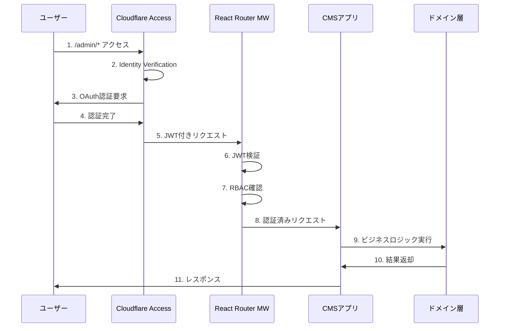

# 認証・セキュリティアーキテクチャ設計

## 1. アーキテクチャ概要

### 1.1 ゼロトラストセキュリティモデル

本CMSは**ゼロトラストセキュリティ**を前提とした多層防御アーキテクチャを採用します。

```
┌─────────────────────────────────────┐
│        Cloudflare Access           │ ← Layer 1: エッジレベル認証
│        (Zero Trust Gateway)        │   Identity Verification
└─────────────────────────────────────┘   Device Trust
                   │
┌─────────────────────────────────────┐
│     React Router Middleware        │ ← Layer 2: アプリケーション認証
│     (JWT Verification & RBAC)      │   Network Segmentation
└─────────────────────────────────────┘   Authorization
                   │
┌─────────────────────────────────────┐
│       Domain Authorization         │ ← Layer 3: ドメインレベル認可
│       (Business Rules)             │   Least Privilege
└─────────────────────────────────────┘
```

### 1.2 認証フロー全体像



## 2. Layer 1: Cloudflare Access（エッジレベル認証）

### 2.1 Identity Verification（身元確認）

**設定方針**:
- 管理画面 (`/admin/*`) への全アクセスをCloudflare Accessで保護
- 複数の認証プロバイダーサポート
- セッション管理と自動タイムアウト

**Cloudflare Access設定例**:
```yaml
# Cloudflare Dashboard設定
applications:
  - name: "CMS Admin Panel"
    domain: "your-cms.workers.dev"
    path: "/admin/*"
    session_duration: "24h"
    auto_redirect_to_identity: true
    
    policies:
      - name: "CMS Administrators"
        decision: "allow"
        rules:
          # 承認されたメールアドレス
          - email: 
              - "admin@company.com"
              - "editor@company.com"
          
          # Google Workspace ドメイン
          - gsuite:
              identity_provider_id: "your-google-workspace-id"
              email_domain: "company.com"
          
          # GitHub Organization
          - github:
              name: "your-org"
              teams: ["cms-admin", "content-team"]

      - name: "Geographic Restriction"
        decision: "allow"
        rules:
          - geo:
              countries: ["JP", "US"] # 日本・アメリカからのみ
      
      - name: "Time-based Access"
        decision: "allow"  
        rules:
          - time:
              time_zone: "Asia/Tokyo"
              days: ["monday", "tuesday", "wednesday", "thursday", "friday"]
              hours:
                start: "09:00"
                end: "18:00"
```

### 2.2 Device Trust（デバイス信頼性）

**段階的デバイス認証**:

```typescript
// Device Trust Levels
export enum DeviceTrustLevel {
  BASIC = 1,    // User-Agent、IP制限
  STANDARD = 2, // + クライアント証明書
  STRICT = 3,   // + デバイス登録、WARP必須
  PARANOID = 4  // + コンプライアンスチェック
}

export interface DeviceTrustPolicy {
  level: DeviceTrustLevel;
  requireClientCert: boolean;
  requireWARP: boolean;
  allowedRegions: string[];
  blockedUserAgents: string[];
}
```

**実装例**:
```typescript
// src/infrastructure/security/DeviceTrustVerifier.ts
export class CloudflareDeviceTrustVerifier {
  constructor(private policy: DeviceTrustPolicy) {}

  async verifyDevice(request: Request): Promise<DeviceTrustResult> {
    const headers = this.extractHeaders(request);
    
    // Level 1: Basic checks
    if (!this.verifyUserAgent(headers.userAgent)) {
      throw new DeviceTrustError('Untrusted user agent');
    }
    
    if (!this.verifyRegion(headers.country)) {
      throw new DeviceTrustError('Access from unauthorized region');
    }
    
    // Level 2: Client certificate
    if (this.policy.requireClientCert && !headers.clientCert) {
      throw new DeviceTrustError('Client certificate required');
    }
    
    // Level 3: WARP verification
    if (this.policy.requireWARP && !headers.warpEnabled) {
      throw new DeviceTrustError('Cloudflare WARP required');
    }
    
    return { trusted: true, level: this.policy.level };
  }

  private extractHeaders(request: Request) {
    return {
      userAgent: request.headers.get('user-agent'),
      country: request.headers.get('cf-ipcountry'),
      clientCert: request.headers.get('cf-client-cert'),
      warpEnabled: request.headers.get('cf-warp-enabled'),
      deviceId: request.headers.get('cf-device-id'),
    };
  }
}
```

## 3. Layer 2: React Router Middleware（アプリケーション認証）

### 3.1 Middleware Architecture

**React Router v7 Middleware活用**:
```typescript
// app/middleware/authentication.ts
import type { MiddlewareFunction } from "@react-router/dev";

export const authenticationMiddleware: MiddlewareFunction = async (request, context) => {
  const url = new URL(request.url);
  
  // 公開パスは認証スキップ
  if (isPublicPath(url.pathname)) {
    return null;
  }
  
  try {
    // 1. Cloudflare Access JWT検証
    const accessJWT = await verifyCloudflareAccessJWT(request);
    
    // 2. Device Trust検証
    await verifyDeviceTrust(request);
    
    // 3. ユーザー情報取得・設定
    const user = await loadUserFromJWT(accessJWT);
    context.user = user;
    
    return null; // Continue to route
    
  } catch (error) {
    // 認証失敗時の処理
    if (error instanceof AuthenticationError) {
      return redirect('/admin/login');
    }
    throw error;
  }
};
```

### 3.2 JWT検証実装

```typescript
// src/infrastructure/auth/CloudflareAccessJWTVerifier.ts
export class CloudflareAccessJWTVerifier {
  constructor(
    private accessClientId: string,
    private accessDomain: string
  ) {}

  async verifyJWT(request: Request): Promise<AccessJWTPayload> {
    const jwt = this.extractJWT(request);
    if (!jwt) {
      throw new AuthenticationError('Access JWT not found');
    }

    try {
      // Cloudflare Access公開鍵で検証
      const jwksUrl = `https://${this.accessDomain}/cdn-cgi/access/certs`;
      const publicKey = await this.getPublicKey(jwksUrl);
      
      const payload = await this.verifySignature(jwt, publicKey);
      
      // ペイロード検証
      this.validatePayload(payload);
      
      return payload;
      
    } catch (error) {
      throw new AuthenticationError(`JWT verification failed: ${error.message}`);
    }
  }

  private extractJWT(request: Request): string | null {
    return request.headers.get('cf-access-jwt-assertion');
  }

  private validatePayload(payload: any): void {
    const now = Math.floor(Date.now() / 1000);
    
    // 有効期限チェック
    if (payload.exp < now) {
      throw new AuthenticationError('JWT expired');
    }
    
    // Audience チェック
    if (payload.aud !== this.accessClientId) {
      throw new AuthenticationError('Invalid audience');
    }
    
    // 必須フィールドチェック
    if (!payload.email || !payload.sub) {
      throw new AuthenticationError('Missing required claims');
    }
  }
}

export interface AccessJWTPayload {
  sub: string;          // User ID
  email: string;        // Email address
  name?: string;        // Display name
  groups?: string[];    // User groups
  iat: number;          // Issued at
  exp: number;          // Expires at
  aud: string;          // Audience
}
```

### 3.3 Network Segmentation（ネットワーク分離）

```typescript
// src/infrastructure/security/NetworkPolicyEnforcer.ts
export class NetworkPolicyEnforcer {
  private readonly policies: NetworkPolicy[] = [
    {
      path: '/admin/system/*',
      allowedIPs: ['192.168.1.0/24', '10.0.0.0/8'],
      allowedCountries: ['JP'],
      requireMTLS: true,
      maxRequestRate: 10, // per minute
    },
    {
      path: '/admin/content/*',
      allowedCountries: ['JP', 'US'],
      requireMTLS: false,
      maxRequestRate: 60,
    },
    {
      path: '/admin/*',
      allowedCountries: ['JP', 'US', 'CA'],
      requireMTLS: false,
      maxRequestRate: 120,
    }
  ];

  async enforcePolicy(request: Request): Promise<void> {
    const url = new URL(request.url);
    const policy = this.findMatchingPolicy(url.pathname);
    
    if (!policy) return;

    const clientIP = request.headers.get('cf-connecting-ip');
    const country = request.headers.get('cf-ipcountry');
    
    // IP制限チェック
    if (policy.allowedIPs && !this.isIPAllowed(clientIP, policy.allowedIPs)) {
      throw new NetworkPolicyError('IP address not allowed');
    }
    
    // 地域制限チェック
    if (policy.allowedCountries && !policy.allowedCountries.includes(country)) {
      throw new NetworkPolicyError('Geographic access denied');
    }
    
    // mTLS要求チェック
    if (policy.requireMTLS && !request.headers.get('cf-client-cert')) {
      throw new NetworkPolicyError('Client certificate required');
    }
    
    // レート制限チェック
    await this.enforceRateLimit(clientIP, url.pathname, policy.maxRequestRate);
  }
}

interface NetworkPolicy {
  path: string;
  allowedIPs?: string[];
  allowedCountries?: string[];
  requireMTLS: boolean;
  maxRequestRate: number;
}
```

## 4. Layer 3: Domain Authorization（ドメインレベル認可）

### 4.1 RBAC (Role-Based Access Control) モデル

```typescript
// src/domain/auth/entities/User.ts
export class User {
  constructor(
    private readonly id: UserId,
    private readonly email: EmailAddress,
    private readonly name: UserName,
    private role: UserRole,
    private readonly createdAt: Date = new Date(),
    private updatedAt: Date = new Date()
  ) {}

  hasPermission(permission: Permission): boolean {
    return this.role.hasPermission(permission);
  }

  hasAnyPermission(permissions: Permission[]): boolean {
    return permissions.some(p => this.hasPermission(p));
  }

  canAccessResource(resource: string, action: string): boolean {
    const permission = Permission.fromResource(resource, action);
    return this.hasPermission(permission);
  }

  changeRole(newRole: UserRole): void {
    this.role = newRole;
    this.updatedAt = new Date();
  }
}

// src/domain/auth/valueObjects/Permission.ts
export class Permission {
  constructor(
    private readonly resource: string,  // 'content', 'media', 'user', 'system'
    private readonly action: string     // 'read', 'create', 'update', 'delete', 'publish'
  ) {}

  static fromString(permission: string): Permission {
    const [resource, action] = permission.split(':');
    return new Permission(resource, action);
  }

  static fromResource(resource: string, action: string): Permission {
    return new Permission(resource, action);
  }

  toString(): string {
    return `${this.resource}:${this.action}`;
  }

  equals(other: Permission): boolean {
    return this.resource === other.resource && this.action === other.action;
  }

  // 定義済み権限
  static readonly CONTENT_READ = new Permission('content', 'read');
  static readonly CONTENT_CREATE = new Permission('content', 'create');
  static readonly CONTENT_UPDATE = new Permission('content', 'update');
  static readonly CONTENT_DELETE = new Permission('content', 'delete');
  static readonly CONTENT_PUBLISH = new Permission('content', 'publish');
  
  static readonly MEDIA_READ = new Permission('media', 'read');
  static readonly MEDIA_UPLOAD = new Permission('media', 'upload');
  static readonly MEDIA_DELETE = new Permission('media', 'delete');
  
  static readonly USER_READ = new Permission('user', 'read');
  static readonly USER_CREATE = new Permission('user', 'create');
  static readonly USER_UPDATE = new Permission('user', 'update');
  static readonly USER_DELETE = new Permission('user', 'delete');
  
  static readonly SYSTEM_CONFIG = new Permission('system', 'config');
  static readonly SYSTEM_BACKUP = new Permission('system', 'backup');
  static readonly SYSTEM_LOGS = new Permission('system', 'logs');
  static readonly SYSTEM_MONITOR = new Permission('system', 'monitor');
}

// src/domain/auth/entities/UserRole.ts
export class UserRole {
  constructor(
    private readonly name: RoleName,
    private readonly permissions: Permission[],
    private readonly description?: string
  ) {}

  hasPermission(permission: Permission): boolean {
    return this.permissions.some(p => p.equals(permission));
  }

  getPermissions(): Permission[] {
    return [...this.permissions];
  }

  getName(): string {
    return this.name.getValue();
  }

  // 標準ロール定義
  static readonly VIEWER = new UserRole(
    RoleName.fromString('viewer'),
    [
      Permission.CONTENT_READ,
      Permission.MEDIA_READ,
    ],
    '閲覧のみ可能'
  );

  static readonly EDITOR = new UserRole(
    RoleName.fromString('editor'),
    [
      Permission.CONTENT_READ,
      Permission.CONTENT_CREATE,
      Permission.CONTENT_UPDATE,
      Permission.MEDIA_READ,
      Permission.MEDIA_UPLOAD,
    ],
    'コンテンツの作成・編集が可能'
  );

  static readonly PUBLISHER = new UserRole(
    RoleName.fromString('publisher'),
    [
      ...UserRole.EDITOR.getPermissions(),
      Permission.CONTENT_PUBLISH,
      Permission.CONTENT_DELETE,
      Permission.MEDIA_DELETE,
    ],
    'コンテンツの公開・削除が可能'
  );

  static readonly ADMIN = new UserRole(
    RoleName.fromString('admin'),
    [
      ...UserRole.PUBLISHER.getPermissions(),
      Permission.USER_READ,
      Permission.USER_CREATE,
      Permission.USER_UPDATE,
      Permission.SYSTEM_CONFIG,
      Permission.SYSTEM_MONITOR,
    ],
    'ユーザー管理とシステム設定が可能'
  );

  static readonly SUPER_ADMIN = new UserRole(
    RoleName.fromString('super_admin'),
    [
      ...UserRole.ADMIN.getPermissions(),
      Permission.USER_DELETE,
      Permission.SYSTEM_BACKUP,
      Permission.SYSTEM_LOGS,
    ],
    '全ての操作が可能'
  );
}
```

### 4.2 Authorization Middleware

```typescript
// app/middleware/authorization.ts
export function requirePermission(permission: Permission) {
  return async function authorizationMiddleware(request: Request, context: any) {
    const user = context.user as User;
    
    if (!user) {
      throw new AuthenticationError('User not authenticated');
    }
    
    if (!user.hasPermission(permission)) {
      throw new AuthorizationError(
        `Permission denied: ${permission.toString()}`
      );
    }
    
    return null; // Continue to route
  };
}

export function requireAnyPermission(permissions: Permission[]) {
  return async function authorizationMiddleware(request: Request, context: any) {
    const user = context.user as User;
    
    if (!user) {
      throw new AuthenticationError('User not authenticated');
    }
    
    if (!user.hasAnyPermission(permissions)) {
      throw new AuthorizationError(
        `One of these permissions required: ${permissions.map(p => p.toString()).join(', ')}`
      );
    }
    
    return null;
  };
}

export function requireRole(roleName: string) {
  return async function roleAuthorizationMiddleware(request: Request, context: any) {
    const user = context.user as User;
    
    if (!user) {
      throw new AuthenticationError('User not authenticated');
    }
    
    if (user.getRole().getName() !== roleName) {
      throw new AuthorizationError(`Role '${roleName}' required`);
    }
    
    return null;
  };
}
```

### 4.3 Route-Level Authorization

```typescript
// app/routes/admin.content.new.tsx
import { requirePermission } from '~/middleware/authorization';
import { Permission } from '~/domain/auth/valueObjects/Permission';

export const middleware = [
  requirePermission(Permission.CONTENT_CREATE)
];

export async function action({ request }: ActionFunctionArgs) {
  // この時点で既にCONTENT_CREATE権限が確認済み
  const formData = await request.formData();
  // コンテンツ作成処理...
}

// app/routes/admin.users.new.tsx
export const middleware = [
  requireRole('admin') // admin またはsuper_admin のみ
];

// app/routes/admin.system.backup.tsx
export const middleware = [
  requirePermission(Permission.SYSTEM_BACKUP)
];
```

## 5. セキュリティ設定・運用

### 5.1 Security Headers

```typescript
// workers/security-headers.ts
export function addSecurityHeaders(response: Response): Response {
  // XSS Protection
  response.headers.set('X-Content-Type-Options', 'nosniff');
  response.headers.set('X-Frame-Options', 'DENY');
  response.headers.set('X-XSS-Protection', '1; mode=block');
  
  // HTTPS Enforcement
  response.headers.set(
    'Strict-Transport-Security', 
    'max-age=31536000; includeSubDomains; preload'
  );
  
  // Referrer Policy
  response.headers.set('Referrer-Policy', 'strict-origin-when-cross-origin');
  
  // Content Security Policy
  const cspDirectives = [
    "default-src 'self'",
    "script-src 'self' 'unsafe-inline' https://static.cloudflareinsights.com",
    "style-src 'self' 'unsafe-inline' https://fonts.googleapis.com",
    "font-src 'self' https://fonts.gstatic.com",
    "img-src 'self' data: https:",
    "connect-src 'self' https://api.cloudflare.com",
    "frame-ancestors 'none'",
  ].join('; ');
  
  response.headers.set('Content-Security-Policy', cspDirectives);
  
  // Permissions Policy
  response.headers.set(
    'Permissions-Policy',
    'camera=(), microphone=(), geolocation=(), payment=()'
  );
  
  return response;
}
```

### 5.2 監査ログ

```typescript
// src/infrastructure/logging/SecurityAuditLogger.ts
export class SecurityAuditLogger {
  constructor(private analyticsEngine: AnalyticsEngineDataset) {}

  async logAuthenticationEvent(event: AuthenticationEvent): Promise<void> {
    await this.analyticsEngine.writeDataPoint({
      timestamp: Date.now(),
      event_type: 'authentication',
      user_id: event.userId,
      email: event.email,
      success: event.success,
      method: event.method, // 'cloudflare_access', 'mfa', etc
      ip_address: event.ipAddress,
      user_agent: event.userAgent,
      country: event.country,
    });
  }

  async logAuthorizationEvent(event: AuthorizationEvent): Promise<void> {
    await this.analyticsEngine.writeDataPoint({
      timestamp: Date.now(),
      event_type: 'authorization',
      user_id: event.userId,
      resource: event.resource,
      action: event.action,
      granted: event.granted,
      reason: event.reason,
    });
  }

  async logSecurityViolation(violation: SecurityViolation): Promise<void> {
    await this.analyticsEngine.writeDataPoint({
      timestamp: Date.now(),
      event_type: 'security_violation',
      violation_type: violation.type,
      severity: violation.severity,
      ip_address: violation.ipAddress,
      user_agent: violation.userAgent,
      details: violation.details,
    });
  }
}
```

## 6. 実装ロードマップ

### Phase 1: 基本認証 (Week 1-2)
- [ ] Cloudflare Access設定
- [ ] React Router Middleware基本実装
- [ ] JWT検証機能
- [ ] 基本的なRBACモデル

### Phase 2: セキュリティ強化 (Week 3-4)
- [ ] Device Trust実装
- [ ] Network Policy Enforcement
- [ ] 詳細なRBAC実装
- [ ] セキュリティヘッダー設定

### Phase 3: 監視・監査 (Week 5-6)
- [ ] セキュリティ監査ログ
- [ ] 異常検知システム
- [ ] アラート設定
- [ ] レポート機能

### Phase 4: 高度なセキュリティ機能 (Week 7-8)
- [ ] mTLS実装
- [ ] 高度なDevice Trust
- [ ] 動的リスク評価
- [ ] ゼロトラスト完全実装

## 7. 関連ドキュメント

- [overview.md](overview.md) - システム全体概要
- [infrastructure.md](infrastructure.md) - Cloudflare Workers設定詳細
- [domain-design.md](domain-design.md) - ドメインモデル設計
- [../implementation/development-guide.md](../implementation/development-guide.md) - 開発実装ガイド

---

**作成日**: 2025-07-01  
**バージョン**: 1.0  
**ステータス**: 設計完了・実装準備中  
**セキュリティレベル**: ゼロトラスト対応