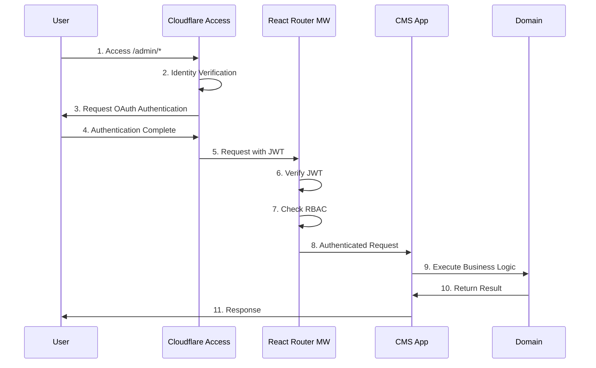

# Authentication & Security Architecture Design

## 1. Architecture Overview

### 1.1 Zero Trust Security Model

This CMS adopts a multi-layered defense architecture based on **Zero Trust Security**.

```
┌─────────────────────────────────────┐
│        Cloudflare Access           │ ← Layer 1: Edge-level Authentication
│        (Zero Trust Gateway)        │   Identity Verification
└─────────────────────────────────────┘   Device Trust
                   │
┌─────────────────────────────────────┐
│     React Router Middleware        │ ← Layer 2: Application Authentication
│     (JWT Verification & RBAC)      │   Network Segmentation
└─────────────────────────────────────┘   Authorization
                   │
┌─────────────────────────────────────┐
│       Domain Authorization         │ ← Layer 3: Domain-level Authorization
│       (Business Rules)             │   Least Privilege
└─────────────────────────────────────┘
```

### 1.2 Overall Authentication Flow



## 2. Layer 1: Cloudflare Access (Edge-level Authentication)

### 2.1 Identity Verification

**Configuration Policy**:
- Protect all access to the admin panel (`/admin/*`) with Cloudflare Access.
- Support multiple identity providers.
- Session management and automatic timeouts.

**Cloudflare Access Configuration Example**:
```yaml
# Cloudflare Dashboard Configuration
applications:
  - name: "CMS Admin Panel"
    domain: "your-cms.workers.dev"
    path: "/admin/*"
    session_duration: "24h"
    auto_redirect_to_identity: true
    
    policies:
      - name: "CMS Administrators"
        decision: "allow"
        rules:
          # Approved email addresses
          - email: 
              - "admin@company.com"
              - "editor@company.com"
          
          # Google Workspace domain
          - gsuite:
              identity_provider_id: "your-google-workspace-id"
              email_domain: "company.com"
          
          # GitHub Organization
          - github:
              name: "your-org"
              teams: ["cms-admin", "content-team"]

      - name: "Geographic Restriction"
        decision: "allow"
        rules:
          - geo:
              countries: ["JP", "US"] # From Japan and US only
      
      - name: "Time-based Access"
        decision: "allow"  
        rules:
          - time:
              time_zone: "Asia/Tokyo"
              days: ["monday", "tuesday", "wednesday", "thursday", "friday"]
              hours:
                start: "09:00"
                end: "18:00"
```

### 2.2 Device Trust

**Phased Device Authentication**:

```typescript
// Device Trust Levels
export enum DeviceTrustLevel {
  BASIC = 1,    // User-Agent, IP restriction
  STANDARD = 2, // + Client certificate
  STRICT = 3,   // + Device registration, WARP required
  PARANOID = 4  // + Compliance check
}

export interface DeviceTrustPolicy {
  level: DeviceTrustLevel;
  requireClientCert: boolean;
  requireWARP: boolean;
  allowedRegions: string[];
  blockedUserAgents: string[];
}
```

**Implementation Example**:
```typescript
// src/infrastructure/security/DeviceTrustVerifier.ts
export class CloudflareDeviceTrustVerifier {
  constructor(private policy: DeviceTrustPolicy) {}

  async verifyDevice(request: Request): Promise<DeviceTrustResult> {
    const headers = this.extractHeaders(request);
    
    // Level 1: Basic checks
    if (!this.verifyUserAgent(headers.userAgent)) {
      throw new DeviceTrustError('Untrusted user agent');
    }
    
    if (!this.verifyRegion(headers.country)) {
      throw new DeviceTrustError('Access from unauthorized region');
    }
    
    // Level 2: Client certificate
    if (this.policy.requireClientCert && !headers.clientCert) {
      throw new DeviceTrustError('Client certificate required');
    }
    
    // Level 3: WARP verification
    if (this.policy.requireWARP && !headers.warpEnabled) {
      throw new DeviceTrustError('Cloudflare WARP required');
    }
    
    return { trusted: true, level: this.policy.level };
  }

  private extractHeaders(request: Request) {
    return {
      userAgent: request.headers.get('user-agent'),
      country: request.headers.get('cf-ipcountry'),
      clientCert: request.headers.get('cf-client-cert'),
      warpEnabled: request.headers.get('cf-warp-enabled'),
      deviceId: request.headers.get('cf-device-id'),
    };
  }
}
```

## 3. Layer 2: React Router Middleware (Application Authentication)

### 3.1 Middleware Architecture

**Leveraging React Router v7 Middleware**:
```typescript
// app/middleware/authentication.ts
import type { MiddlewareFunction } from "@react-router/dev";

export const authenticationMiddleware: MiddlewareFunction = async (request, context) => {
  const url = new URL(request.url);
  
  // Skip authentication for public paths
  if (isPublicPath(url.pathname)) {
    return null;
  }
  
  try {
    // 1. Verify Cloudflare Access JWT
    const accessJWT = await verifyCloudflareAccessJWT(request);
    
    // 2. Verify Device Trust
    await verifyDeviceTrust(request);
    
    // 3. Get and set user information
    const user = await loadUserFromJWT(accessJWT);
    context.user = user;
    
    return null; // Continue to route
    
  } catch (error) {
    // Handle authentication failure
    if (error instanceof AuthenticationError) {
      return redirect('/admin/login');
    }
    throw error;
  }
};
```

### 3.2 JWT Verification Implementation

```typescript
// src/infrastructure/auth/CloudflareAccessJWTVerifier.ts
export class CloudflareAccessJWTVerifier {
  constructor(
    private accessClientId: string,
    private accessDomain: string
  ) {}

  async verifyJWT(request: Request): Promise<AccessJWTPayload> {
    const jwt = this.extractJWT(request);
    if (!jwt) {
      throw new AuthenticationError('Access JWT not found');
    }

    try {
      // Verify with Cloudflare Access public key
      const jwksUrl = `https://${this.accessDomain}/cdn-cgi/access/certs`;
      const publicKey = await this.getPublicKey(jwksUrl);
      
      const payload = await this.verifySignature(jwt, publicKey);
      
      // Validate payload
      this.validatePayload(payload);
      
      return payload;
      
    } catch (error) {
      throw new AuthenticationError(`JWT verification failed: ${error.message}`);
    }
  }

  private extractJWT(request: Request): string | null {
    return request.headers.get('cf-access-jwt-assertion');
  }

  private validatePayload(payload: any): void {
    const now = Math.floor(Date.now() / 1000);
    
    // Check expiration
    if (payload.exp < now) {
      throw new AuthenticationError('JWT expired');
    }
    
    // Check audience
    if (payload.aud !== this.accessClientId) {
      throw new AuthenticationError('Invalid audience');
    }
    
    // Check required fields
    if (!payload.email || !payload.sub) {
      throw new AuthenticationError('Missing required claims');
    }
  }
}

export interface AccessJWTPayload {
  sub: string;          // User ID
  email: string;        // Email address
  name?: string;        // Display name
  groups?: string[];    // User groups
  iat: number;          // Issued at
  exp: number;          // Expires at
  aud: string;          // Audience
}
```

### 3.3 Network Segmentation

```typescript
// src/infrastructure/security/NetworkPolicyEnforcer.ts
export class NetworkPolicyEnforcer {
  private readonly policies: NetworkPolicy[] = [
    {
      path: '/admin/system/*',
      allowedIPs: ['192.168.1.0/24', '10.0.0.0/8'],
      allowedCountries: ['JP'],
      requireMTLS: true,
      maxRequestRate: 10, // per minute
    },
    {
      path: '/admin/content/*',
      allowedCountries: ['JP', 'US'],
      requireMTLS: false,
      maxRequestRate: 60,
    },
    {
      path: '/admin/*',
      allowedCountries: ['JP', 'US', 'CA'],
      requireMTLS: false,
      maxRequestRate: 120,
    }
  ];

  async enforcePolicy(request: Request): Promise<void> {
    const url = new URL(request.url);
    const policy = this.findMatchingPolicy(url.pathname);
    
    if (!policy) return;

    const clientIP = request.headers.get('cf-connecting-ip');
    const country = request.headers.get('cf-ipcountry');
    
    // Check IP restriction
    if (policy.allowedIPs && !this.isIPAllowed(clientIP, policy.allowedIPs)) {
      throw new NetworkPolicyError('IP address not allowed');
    }
    
    // Check geographic restriction
    if (policy.allowedCountries && !policy.allowedCountries.includes(country)) {
      throw new NetworkPolicyError('Geographic access denied');
    }
    
    // Check mTLS requirement
    if (policy.requireMTLS && !request.headers.get('cf-client-cert')) {
      throw new NetworkPolicyError('Client certificate required');
    }
    
    // Check rate limit
    await this.enforceRateLimit(clientIP, url.pathname, policy.maxRequestRate);
  }
}

interface NetworkPolicy {
  path: string;
  allowedIPs?: string[];
  allowedCountries?: string[];
  requireMTLS: boolean;
  maxRequestRate: number;
}
```

## 4. Layer 3: Domain Authorization

### 4.1 RBAC (Role-Based Access Control) Model

The application's domain layer implements detailed authorization control based on the RBAC model.

Access to specific operations (such as creating content, publishing, user management, etc.) is granted or denied based on the user's Role and Permissions.

For details on this domain model, please refer to the following document:

- **[RBAC Domain Model Design](rbac-domain-model.md)**

### 4.2 Authorization Middleware

We use React Router's Middleware to enforce authorization checks at the route level. This ensures that only users with specific permissions can execute the corresponding route handlers (`loader` or `action`).

```typescript
// app/middleware/authorization.ts
import { requirePermission, requireRole } from '~/middleware/authorization';
import { Permission } from '~/domain/auth/valueObjects/Permission';

// Middleware to require a specific permission
export const middlewareForCreateContent = [
  requirePermission(Permission.CONTENT_CREATE)
];

// Middleware to require a specific role
export const middlewareForUserManagement = [
  requireRole('admin')
];
```

For detailed implementation patterns, please refer to [React Router Middleware Implementation Patterns](../implementation/react-router-middleware-patterns.md).

## 5. Security Settings & Operations

### 5.1 Security Headers

```typescript
// workers/security-headers.ts
export function addSecurityHeaders(response: Response): Response {
  // XSS Protection
  response.headers.set('X-Content-Type-Options', 'nosniff');
  response.headers.set('X-Frame-Options', 'DENY');
  response.headers.set('X-XSS-Protection', '1; mode=block');
  
  // HTTPS Enforcement
  response.headers.set(
    'Strict-Transport-Security', 
    'max-age=31536000; includeSubDomains; preload'
  );
  
  // Referrer Policy
  response.headers.set('Referrer-Policy', 'strict-origin-when-cross-origin');
  
  // Content Security Policy
  const cspDirectives = [
    "default-src 'self'",
    "script-src 'self' 'unsafe-inline' https://static.cloudflareinsights.com",
    "style-src 'self' 'unsafe-inline' https://fonts.googleapis.com",
    "font-src 'self' https://fonts.gstatic.com",
    "img-src 'self' data: https:",
    "connect-src 'self' https://api.cloudflare.com",
    "frame-ancestors 'none'",
  ].join('; ');
  
  response.headers.set('Content-Security-Policy', cspDirectives);
  
  // Permissions Policy
  response.headers.set(
    'Permissions-Policy',
    'camera=(), microphone=(), geolocation=(), payment=()'
  );
  
  return response;
}
```

### 5.2 Audit Log

```typescript
// src/infrastructure/logging/SecurityAuditLogger.ts
export class SecurityAuditLogger {
  constructor(private analyticsEngine: AnalyticsEngineDataset) {}

  async logAuthenticationEvent(event: AuthenticationEvent): Promise<void> {
    await this.analyticsEngine.writeDataPoint({
      timestamp: Date.now(),
      event_type: 'authentication',
      user_id: event.userId,
      email: event.email,
      success: event.success,
      method: event.method, // 'cloudflare_access', 'mfa', etc
      ip_address: event.ipAddress,
      user_agent: event.userAgent,
      country: event.country,
    });
  }

  async logAuthorizationEvent(event: AuthorizationEvent): Promise<void> {
    await this.analyticsEngine.writeDataPoint({
      timestamp: Date.now(),
      event_type: 'authorization',
      user_id: event.userId,
      resource: event.resource,
      action: event.action,
      granted: event.granted,
      reason: event.reason,
    });
  }

  async logSecurityViolation(violation: SecurityViolation): Promise<void> {
    await this.analyticsEngine.writeDataPoint({
      timestamp: Date.now(),
      event_type: 'security_violation',
      violation_type: violation.type,
      severity: violation.severity,
      ip_address: violation.ipAddress,
      user_agent: violation.userAgent,
      details: violation.details,
    });
  }
}
```

## 6. Implementation Roadmap

### Phase 1: Basic Authentication (Weeks 1-2)
- [ ] Cloudflare Access configuration
- [ ] Basic React Router Middleware implementation
- [ ] JWT verification functionality
- [ ] Basic RBAC model

### Phase 2: Security Enhancement (Weeks 3-4)
- [ ] Device Trust implementation
- [ ] Network Policy Enforcement
- [ ] Detailed RBAC implementation
- [ ] Security header configuration

### Phase 3: Monitoring & Auditing (Weeks 5-6)
- [ ] Security audit log
- [ ] Anomaly detection system
- [ ] Alert configuration
- [ ] Reporting functionality

### Phase 4: Advanced Security Features (Weeks 7-8)
- [ ] mTLS implementation
- [ ] Advanced Device Trust
- [ ] Dynamic risk assessment
- [ ] Full Zero Trust implementation

## 7. Related Documents

- [overview.md](overview.md) - System Overview
- [infrastructure.md](infrastructure.md) - Cloudflare Workers Configuration Details
- [domain-design.md](domain-design.md) - Domain Model Design
- [../implementation/development-guide.md](../implementation/development-guide.md) - Development Implementation Guide

---

**Last Updated**: 2025-07-02
**Version**: 2.0
**Status**: Design complete, implementation ready
**Security Level**: Zero Trust Compliant
